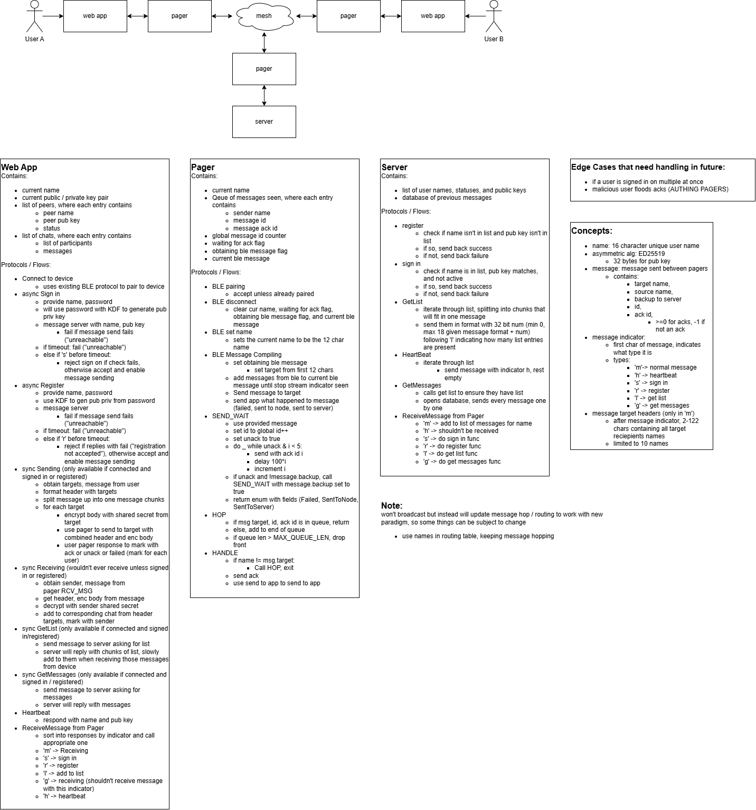

# Meshenger

## Summary

Meshenger is a secure, decentralized messaging system built on ESP32 devices. It enables peer-to-peer communication through a mesh network using ESP-NOW for long-range connectivity, with a BLE pager acting as a bridge to a web-based user interface. The system supports encrypted messaging via cryptographic utilities, allowing users to send messages across a network of nodes without relying on centralized servers.

### Diagram:


## Range & Capacity

### Distance

ESP-NOW operates in the 2.4 GHz band. The maximum **measured** distance between two nodes is **285 feet (≈ 87 m)** in direct line of sight. Real-world range will be lower in environments with walls, interference, or obstructions.

Because Meshenger is a multi-hop mesh, nodes that are out of direct range of each other can still communicate by relaying messages through intermediate nodes. Theoretical end-to-end range scales with the number of nodes and their placement.

The table below shows theoretical maximum end-to-end range for a linear chain of nodes, each spaced at the 285 ft measured limit (direct line of sight, ideal conditions):

| Nodes | Hops | Max Distance (ft) | Max Distance (m) | Max Distance (mi) |
|------:|-----:|------------------:|-----------------:|------------------:|
| 2 | 1 | 285 | 87 | 0.05 |
| 3 | 2 | 570 | 174 | 0.11 |
| 4 | 3 | 855 | 261 | 0.16 |
| 5 | 4 | 1,140 | 347 | 0.22 |
| 6 | 5 | 1,425 | 434 | 0.27 |
| 7 | 6 | 1,710 | 521 | 0.32 |
| 8 | 7 | 1,995 | 608 | 0.38 |
| 9 | 8 | 2,280 | 695 | 0.43 |
| 10 | 9 | 2,565 | 782 | 0.49 |

> These are theoretical maximums under ideal line-of-sight conditions. Actual range per hop will be shorter in real environments.

### User / Node Limits

| Limit | Value |
|-------|-------|
| Max peers per node (ESP-NOW hardware) | 20 |
| Max users in a group chat | 10 |
| Practical network size | depends on node placement and hop count |

The 10-user group chat ceiling is a software limit imposed to keep routing and peer-table overhead manageable on constrained ESP32 hardware.

---

## Table of Contents

- [Range & Capacity](#range--capacity)
- [How to Test Meshenger (Web App + Pager)](#how-to-test-meshenger-web-app--pager)
- [App README](./App/README.md)
- [Pager README](./Pager/README.md)
- [Mesh Helpers README](./Mesh/README.md)
- [Mesh Crypto README](./Mesh/Crypto/README.md)
- [Mesh Server README](./Mesh/Server/README.md)

## How to Test Meshenger (Web App + Pager)

Step-by-step commands to build the Pager firmware, flash it to an ESP32, run the web app, and test BLE messaging. Every command is listed so you can copy-paste.

**Start here:** Clone the repo (e.g. `git clone <repo-url> && cd Meshenger`), or open your existing clone. Then open a terminal in the **project root**—the folder that contains `App/`, `Pager/`, and `Mesh/`. All commands below are meant to be run from that project root unless noted.

---

### Prerequisites

- **Arduino CLI** – [Install arduino-cli](https://docs.arduino.cc/arduino-cli/)
- **ESP32 board support** – Install the ESP32 core (one-time)
- **Python 3** – For serving the web app (usually pre-installed on Mac/Linux)
- **Chrome** – Web Bluetooth only works in Chrome (or another browser with [Web Bluetooth](https://caniuse.com/web-bluetooth) support)
- **ESP32 board** – Connected via USB

---

### 1. One-time setup

From the **project root** (the folder that contains `App/`, `Pager/`, `Mesh/`):

Add the ESP32 board index and install the ESP32 core (if you haven’t already):

```bash
arduino-cli config add board_manager.additional_urls https://raw.githubusercontent.com/espressif/arduino-esp32/gh-pages/package_esp32_index.json
arduino-cli core update-index
arduino-cli core install esp32:esp32
```

Optional: if this repo includes a setup script, you can run it instead:

```bash
./Setup/arduino-cli.sh init
```

---

### 2. Find the ESP32 port

List connected boards to get the port. On **Mac** it’s often `/dev/cu.usbserial-*` or `/dev/cu.SLAB_USBtoUART`; on **Linux** it’s usually `/dev/ttyUSB*` or `/dev/ttyACM*`; on **Windows** it’s typically `COM3`, `COM4`, etc.

```bash
arduino-cli board list
```

Note the port for your ESP32. You’ll use it in the next steps (e.g. `--port /dev/cu.usbserial-0001` or `--port COM4`).

---

### 3. Build the Pager sketch

The Pager is the BLE bridge the web app talks to. Build it with the **huge_app** partition so it fits:

```bash
arduino-cli compile --fqbn esp32:esp32:esp32:PartitionScheme=huge_app Pager/ble_serial/ble_serial.ino
```

If you see **“Peer was not declared”** or other compile errors, make sure you’re in the project root and using the path above.

---

### 4. Flash the Pager to the ESP32

Replace `YOUR_PORT` with the port from step 2. Examples:

- **Mac:** `/dev/cu.usbserial-0001`
- **Linux:** `/dev/ttyUSB0`
- **Windows:** `COM4`

```bash
arduino-cli upload --fqbn esp32:esp32:esp32:PartitionScheme=huge_app --port YOUR_PORT Pager/ble_serial/ble_serial.ino
```

If you get **“Image length doesn’t fit”** or **“No bootable app partitions”**, erase the flash and upload again:

```bash
arduino-cli upload --fqbn esp32:esp32:esp32:PartitionScheme=huge_app --port YOUR_PORT --erase-all Pager/ble_serial/ble_serial.ino
```

---

### 5. Open the serial monitor (optional)

Useful to see `[BLE]`, `[RX]`, `[TX]` and confirm the board is running. Use the **same port** as in step 4 and **115200** baud:

```bash
arduino-cli monitor --port YOUR_PORT --config baudrate=115200
```

Replace `YOUR_PORT` with your actual port (e.g. `/dev/cu.usbserial-0001`, `COM4`).

You should see something like:

```
========== Meshenger Pager ==========
BLE NUS - connect with web app or any NUS client
=====================================

[BLE] Advertising as "Meshenger-Pager"
```

To exit the monitor: **Ctrl+C**.

---

### 6. Serve the web app

Open a **new** terminal (leave the serial monitor running in the other if you use it). From the **project root**:

```bash
cd App
python3 -m http.server 8000
```

Or from any directory, using the full path to the `App` folder:

```bash
python3 -m http.server 8000 --directory /path/to/Meshenger/App
```

Leave the server running. You should see something like:

```
Serving HTTP on :: port 8000 (http://[::]:8000/) ...
```

---

### 7. Test in the browser

1. Open **Chrome** and go to:
   ```
   http://localhost:8000
   ```

2. Click **“Connect to device”**.  
   The browser will show a BLE device picker.

3. Select the **“Meshenger-Pager”** (or “Meshenger-PagerTest”) device and click **Pair** / **Connect**.

4. After it connects:
   - Go to **Messages** (or stay on Peers and open a chat).
   - Type a message and press **Enter** or **Send**.

5. On the **serial monitor** (if you have it open) you should see:
   - `[BLE] Client connected` when you connect.
   - `[RX] your message` when you send from the app.
   - `[TX] Sending to app (N bytes)` when the board sends to the app (e.g. if you type in the serial monitor).

6. To disconnect, click **“Disconnect”** in the app. On the board you’ll see `[BLE] Client disconnected` and `[BLE] Advertising restarted`.

---

### Quick reference: all commands in order

Run these from the **project root** (the folder that contains `App/`, `Pager/`, `Mesh/`). Replace `YOUR_PORT` with your ESP32 port from `arduino-cli board list`.

**Terminal 1 – build, flash, and optionally monitor:**

```bash
# Find your port (Mac: /dev/cu.usbserial-*, Linux: /dev/ttyUSB*, Windows: COM*)
arduino-cli board list

# Build Pager
arduino-cli compile --fqbn esp32:esp32:esp32:PartitionScheme=huge_app Pager/ble_serial/ble_serial.ino

# Flash Pager
arduino-cli upload --fqbn esp32:esp32:esp32:PartitionScheme=huge_app --port YOUR_PORT Pager/ble_serial/ble_serial.ino

# Serial monitor (optional; Ctrl+C to exit)
arduino-cli monitor --port YOUR_PORT --config baudrate=115200
```

**Terminal 2 – web app:**

```bash
cd App
python3 -m http.server 8000
```

Then in Chrome: **http://localhost:8000** → Connect to device → send messages.

---

### Building the mesh node (optional)

The **mesh node** is the ESP-NOW firmware (different from the Pager). To build and flash it from the project root:

```bash
make build
make upload PORT=YOUR_PORT
make monitor PORT=YOUR_PORT
```

Use the same port as for the Pager (e.g. `PORT=/dev/cu.usbserial-0001` or `PORT=COM4`). The Makefile uses `PartitionScheme=huge_app` and builds `Mesh/Node/node`.

---

### Troubleshooting

| Issue | What to do |
|-------|------------|
| **Device not in BLE picker** | Ensure the Pager is powered and you’ve flashed `ble_serial.ino`. Check serial monitor for `[BLE] Advertising as "Meshenger-Pager"`. |
| **“Image doesn’t fit” / partition errors** | Use `--erase-all` once: `arduino-cli upload ... --erase-all Pager/ble_serial/ble_serial.ino` |
| **Web Bluetooth greyed out / not working** | Use **Chrome** and **http://localhost:8000** (not `file://`). Web Bluetooth requires a secure context (HTTPS or localhost). |
| **Garbage in serial** | Open the monitor **after** the board has booted, or reset the board. The banner `========== Meshenger Pager ==========` marks where app logging starts. |
| **Wrong port** | Run `arduino-cli board list` and use the port shown for your ESP32. On Windows, use `COM3` style; on Mac/Linux use the full path (e.g. `/dev/cu.usbserial-0001`). |
